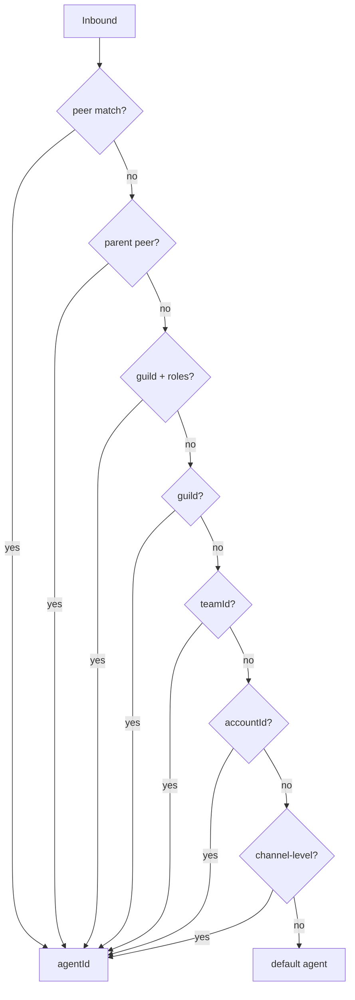

# Clawcon Sunum Slaytları
# OpenClaw Multi-Agent + Team-Pipeline Plugin

> Format: Marp / Slidev uyumlu markdown. Her `---` yeni slayt.
> Konuşma notları HTML yorumu olarak (`<!-- ... -->`) gömülü.
> Süre hedefi: 35 dk (taban 25, tavan 40).

---

<!-- _class: title -->

# Birden Fazla Beyin, Tek Host
## OpenClaw Multi-Agent + Bir Plugin Hikayesi

**Clawcon** · `@kullanici` · `github.com/.../team-pipeline-plugin`

<!--
[0:00-0:20] "Selam Clawcon! Bugün tek bir host'ta birden fazla AI persona'sını
nasıl çalıştırırız ve bunların üstüne kendi orchestration plugin'imi nasıl yazdım,
onu anlatacağım. Plan: önce multi-agent'ın temellerini kuruyoruz, sonra plugin'le
zirveye çıkıyoruz."
-->

---

## Hook: Tek bir AI yetmedi

- Ailem WhatsApp'ta yazıyor → cevap arkadaş gibi olmalı, `exec` yok
- İş Slack'i → `read/write/exec` lazım, sandboxed
- Kişisel Telegram'da Opus konuşmaları → derin iş
- **Aynı host. Sıfır cross-talk. Sıfır auth karışması.**

<!--
[0:20-2:30] "Geçen sene benim sorunum şuydu: ailem WhatsApp'tan, iş arkadaşlarım
Slack'ten yazıyor. Aynı laptop. Üç farklı kişilik istiyorum: aile için kibar
ve KOD ÇALIŞTIRMAYAN, iş için tam yetkili sandboxed, kişisel için derin
düşünen. Klasik chatbot framework'lerinde bunu yapmak isterken auth profilleri
karışıyor, session geçmişleri sızıyor, tool izinleri global oluyordu. OpenClaw'ın
multi-agent feature'ı bu sorunu kökten çözüyor — bugün önce ona bakacağız."
-->

---

## Multi-Agent nedir?

**Tek Gateway, N izole agent persona'sı.**

Her birinin kendi:

- 📁 Workspace (dosyalar, skills, AGENTS.md)
- 🔐 Auth profile (`agentDir/auth-profiles.json`)
- 💾 Session store (`sessions/`)
- 🛠 Tool policy (allow/deny per agent)
- 📦 Sandbox (off / docker / per-agent setup)

<!--
[2:30-4:00] "Multi-agent'ın özü: tek bir Gateway process'i, içinde birbirinden
beş boyutta izole edilmiş agent'lar. Workspace ayrı, auth ayrı, session ayrı,
tool policy ayrı, sandbox ayrı. Cross-talk yok çünkü hiçbir state paylaşılmıyor."
-->

---

## Disk üzerinde nasıl görünüyor?

```text
~/.openclaw/
├── openclaw.json                    # config root
├── workspace/                       # main agent (default)
└── agents/
    ├── main/
    │   ├── agent/auth-profiles.json
    │   └── sessions/
    ├── coding/
    │   ├── agent/auth-profiles.json
    │   └── sessions/
    └── family/
        ├── agent/auth-profiles.json
        └── sessions/
```

> **Critical rule:** *Never reuse `agentDir` across agents* — zod-level guard.

<!--
[4:00-5:30] "Bu disk haritası izolasyonu somutlaştırıyor. Her agent kendi
agentDir'ında. config'de aynı agentDir'ı iki agent'a vermeye çalışırsan
zod schema reddediyor: src/config/config.multi-agent-agentdir-validation.test.ts.
OAuth refresh token'ları kazara klonlanmasın diye."
-->

---

## Inbound mesaj geldi → hangi agent?

**Bindings** = config'deki routing kuralları.
8 kademeli precedence ağacı, ilk eşleşme kazanır.

```json5
bindings: [
  { agentId: "family",
    match: { channel: "whatsapp", peer: { kind: "group", id: "120363999@g.us" } } },
  { agentId: "coding",
    match: { channel: "discord", accountId: "coding-bot" } },
  { agentId: "main", match: { channel: "*" } },  // fallback
]
```

<!--
[5:30-7:00] "Routing tamamen deklaratif. Hiçbir LLM yok, hiçbir öğrenme yok —
sadece config'deki bindings dizisi. Inbound mesaj geldiğinde 8 kademeli bir
precedence ağacında ilk eşleşme kazanır. Şimdi o ağacı görelim."
-->

---

## 8 kademeli precedence



**`src/routing/resolve-route.ts:610` → `resolveAgentRoute()`**

<!--
[7:00-9:00] "İşte ağaç. Spesifik'ten genele iniyor: önce peer (yani belirli
bir DM/grup ID'si), sonra parent peer (thread inheritance), Discord guild +
roller, sonra sadece guild, Slack team, account ID, channel-level, en son
default. Bu sıralama deterministik — aynı input her zaman aynı agent'a
gidiyor. Test edilmesi kolay, debug edilmesi kolay."
-->

---

## Canlı: `openclaw agents list --bindings`

```bash
$ openclaw agents list --bindings

main      [default]              channel:* (fallback)
family    workspace=family       whatsapp:peer:group:120363999@g.us
coding    workspace=coding       discord:account:coding-bot
ops       workspace=ops          slack:team:T01234567
```

<!--
[9:00-10:30] "Pratik: bu komut sahnede çalışıyor. CLI sana hangi agent'ın
hangi binding'den match aldığını gösteriyor. Debug aracı, prod'da operator
için, demo'da seyirci için ideal. Şimdi iç tarafa bakalım — agent seçildi,
peki session nereye yazılıyor?"
-->

---

## Session keying

**Format:** `agent:<agentId>:<mainKey>`

Örnekler:
- `agent:main:main` — default DM bucket
- `agent:family:dm:direct:120363999@g.us` — aile WhatsApp grubu
- `agent:coding:dm:direct:U01234567` — Slack DM

**Builder:** `src/routing/session-key.ts` → `buildAgentMainSessionKey()`

<!--
[10:30-12:00] "Session key formatı agent ID'yi prefix olarak içeriyor.
Aynı physical channel'a birden fazla peer geliyorsa her birini ayrı
bucket'ta tutabiliyoruz, ama her bucket'ın agent kimliği belli. Memory
search bile agent boundary'sine saygı duyuyor — extraCollections opt-in."
-->

---

## Per-agent güvenlik: Aile agent'ı

```json5
{
  id: "family",
  workspace: "~/.openclaw/workspace-family",
  groupChat: { mentionPatterns: ["@family", "@familybot"] },
  sandbox: {
    mode: "all",
    scope: "agent",
    docker: { setupCommand: "apt-get update && apt-get install -y git" }
  },
  tools: { allow: ["read"], deny: ["exec", "write", "edit", "browser"] },
}
```

`src/agents/sandbox/tool-policy.ts` → `resolveSandboxToolPolicy()`

<!--
[12:00-14:00] "Bu config'i okurken: aile agent'ı sadece mention edildiğinde
cevap veriyor (mentionPatterns), tüm sandbox'a Docker'da koşuyor (mode:all),
ve sadece read tool'una izinli. Yazma, exec, browser yok. 'Çocuğum yanlışlıkla
agent'a sistemde bir şey sildirir' korkusu sıfır. Bu izolasyon agent-bazlı,
config-driven, zod-validated."
-->

---

## "Peki ya agent'ları orchestrate etmek?"

> Manager-of-managers? Nested planner? Hierarchical AI team?

<!--
[14:00-15:00] "Buraya kadar her şey güzel — N tane izole agent var. Peki
biri bana 'her gelen task'ı doğru takıma yönlendir, paralel veya seri çalıştır'
desin istersem? Bu klasik manager-of-managers problemi. OpenClaw'ın bu konuda
çok net bir pozisyonu var — VISION.md'den okuyayım."
-->

---

<!-- _class: vision-quote -->

## VISION.md

> ## What We Will Not Merge (For Now)
>
> - **Agent-hierarchy frameworks** (manager-of-managers / nested planner trees) **as a default architecture**
> - Heavy orchestration layers that duplicate existing agent and tool infrastructure

`VISION.md:113-114`

<!--
[15:00-16:00] (KELIME-KELIME — vision-pivot-script.md'ye bak)
"Bu cümle bu sunumun dönüm noktası. OpenClaw diyor ki: orchestration framework'ünü
core'a koymayacağız. Ama dikkat — yasaklamıyor. Diyor ki 'as a default architecture'.
Yani DEFAULT olarak değil. Plugin olarak? Açık. İşte ben tam o boşluğa girdim."
-->

---

## Neden core hayır diyor?

**Plugin felsefesi (`VISION.md:54-71`):**

- Core lean kalır, plugin API genişler
- Optional capability ships as **plugins**, not core
- "Bundle-style plugins over code plugins" — küçük yüzey, stabil interface
- ClawHub'da publish, opt-in install

**Sonuç:** Manager-of-managers istiyorsam **plugin** yazarım.
Core temiz kalır, kullanıcı opt-in seçer.

<!--
[16:00-17:30] "Bu felsefe sebepsiz değil. Core'a orchestration koysan zorunlu
hale gelir. İnsanlar farklı orchestration stilleri istiyor — bazı sequential,
bazı parallel, bazı LLM router, bazı rule-based. Core'a tek bir tane koymak
diğer hepsini ezerdi. Plugin yolu: opsiyonel, opt-in, kullanıcı seçiyor.
Şimdi benim yazdığım plugin'e geçelim."
-->

---

<!-- _class: plugin-hero -->

## Team-Pipeline Plugin

> *LLM-router seçer, sequential pipeline çalıştırır —
> multi-agent primitiflerini kullanarak.*

<!--
[17:30-18:00] "Plugin'in tanımı tek cümle: gelen task'a bakan bir LLM router
doğru takımı seçiyor, sonra o takım sequential olarak çalışıyor. Multi-agent'ı
yeniden inşa etmiyor — onun primitif'lerinin üzerine biniyor."
-->

---

## Plugin Mimarisi

```text
[Inbound task]
      ↓
[Custom Channel] ─ bindings ─→ Router agent
      ↓
[Router Agent (LLM)] ─ plugin-sdk tool: select_team(task) → teamId
      ↓
[Team Resolver]  ─ config'den team profilini okur
      ↓
[Sequential Executor]
   ├─ sessions_spawn → Agent A (analyzer)
   ├─ sessions_spawn → Agent B (executor)
   └─ sessions_spawn → Agent C (reviewer)
      ↓
[Final response → channel]
```

<!--
[18:00-20:00] "Akış: inbound task custom channel'a giriyor, bindings router
agent'a yönlendiriyor. Router LLM'i select_team tool'unu çağırıyor, dönen
teamId'ye göre team resolver config'den takımı çekiyor, sequential executor
takımı sırayla sessions_spawn ile çalıştırıyor, son agent'ın çıktısı kanala
geri dönüyor. Şimdi her bir entegrasyon noktasını ayrı görelim."
-->

---

## (1/4) Custom Channel + Bindings

```typescript
// plugin entry
export default definePlugin({
  channels: {
    "team-pipeline": {
      ingest: async (msg) => routeToRouterAgent(msg),
    }
  }
});
```

```json5
// kullanıcı config'i
bindings: [
  { agentId: "router-design",  match: { channel: "team-pipeline", accountId: "design" } },
  { agentId: "router-backend", match: { channel: "team-pipeline", accountId: "backend" } },
]
```

<!--
[20:00-21:00] "İlk entegrasyon: plugin yeni bir channel kaydediyor —
'team-pipeline'. Kullanıcı bindings'da bu channel'ın hangi accountId'sinin
hangi router agent'a gideceğini yazıyor. Yani aynı plugin birden fazla
takım profiliyle paralel kullanılabiliyor. multi-account precedence devrede."
-->

---

## (2/4) Plugin-SDK Tool: `select_team`

```typescript
defineTool({
  name: "select_team",
  description: "Select the appropriate team for an inbound task",
  schema: z.object({
    task: z.string(),
    available_teams: z.array(z.string()),
  }),
  output: z.object({
    teamId: z.enum(KNOWN_TEAMS),  // ← LLM cevabını enum'a zorla
    rationale: z.string(),
  }),
  handler: async ({ task, available_teams }, ctx) => {
    return routerLlmCall(task, available_teams, ctx);
  }
});
```

<!--
[21:00-22:00] "İkinci entegrasyon: plugin yeni bir tool kaydediyor —
select_team. Router agent bu tool'u çağırıyor. Dikkat: output schema'sı
zod enum. LLM serbest metin döndüremez, KNOWN_TEAMS dışında bir şey
söylerse plugin-sdk reddediyor. Halüsinasyon yok."
-->

---

## (3/4) Subagents / `sessions_spawn`

```typescript
async function runPipeline(teamId: string, task: string) {
  const team = TEAMS[teamId];           // ["analyzer", "executor", "reviewer"]
  let payload = task;

  for (const agentId of team) {
    payload = await ctx.tools.sessions_spawn({
      target_agent_id: agentId,
      message: payload,
    });
  }

  return payload;
}
```

`src/agents/openclaw-tools.subagents.scope.test.ts` — `allowAgents` enforcement

<!--
[22:00-23:00] "Üçüncü entegrasyon: sessions_spawn ile sequential pipeline.
Her adımda önceki agent'ın çıktısı sonrakinin girdisi oluyor. Cross-agent
spawn'lar OpenClaw'da allowAgents config'iyle whitelist'leniyor. Yani
router-design agent'ı sadece design takımındaki agent'ları spawn edebilir.
Cross-team isolation otomatik."
-->

---

## (4/4) Broadcast Groups (future)

```json5
// gelecek versiyon: parallel mod
teams: {
  "rapid-review": {
    mode: "parallel",
    agents: ["security-reviewer", "perf-reviewer", "style-reviewer"],
    consolidator: "lead-reviewer",
  }
}
```

`docs/channels/broadcast-groups.md`

<!--
[23:00-23:30] "Dördüncü entegrasyon noktası — şu an experimental, plugin'in
v2'sinde gelecek: broadcast groups. Sequential yerine parallel. 3 reviewer
aynı task'ı paralel inceleyip lead-reviewer'a sonuçları konsolide ediyor.
Multi-agent + broadcast = paralel team execution."
-->

---

<!-- _class: demo -->

## DEMO

**Test task:**
> *"Bu Python script'inde bug var, fix et ve test ekle."*

**Beklenen akış:**
1. Custom channel'a düşer
2. Router LLM `coding-team` seçer
3. `analyzer → executor → reviewer` zinciri çalışır
4. Final cevap kanala döner

<!--
[23:30-30:00] CANLI DEMO — 6 dk.
Eğer sorun olursa: yedek video (90 sn) + komut çıktısını okuyarak anlat.
demo/setup.sh'ı önceden çalıştırılmış olmalı.
-->

---

## Edge Cases & Guardrails

- **Router yanlış takımı seçerse?**
  Fallback policy + observability (`agent_id` JSONL log alanı, CHANGELOG #51075)
- **Pipeline ortasında agent fail ederse?**
  Retry vs abort policy (config'de seçilebilir)
- **Auth profile cross-talk?**
  Her worker kendi `agentDir`'ında. Refresh-token paylaşılmaz (CHANGELOG #74055)
- **Team versiyonlama?**
  Bindings ile `accountId: "design-v2"` → yeni router agent

<!--
[30:00-32:00] "Geliştirici kitlesi bu kısmı bekliyor. Plugin sadece happy
path'te çalışmamalı. Fail modes: router halüsinasyonu (zod enum koruması),
pipeline ortası fail (config'de retry/abort), auth cross-talk (her worker
kendi agentDir'ında), versiyonlama (bindings + accountId). Hepsi multi-agent
primitif'lerinden ücretsiz geliyor."
-->

---

## Plugin felsefesi çalışıyor

| Core'da olmayan | Plugin'de var |
|---|---|
| Manager-of-managers | ✅ LLM-router |
| Nested planner | ✅ Sequential pipeline |
| Team selection | ✅ select_team tool |
| Workflow definition | ✅ Team config |

**Core lean kaldı. Capability opt-in geldi.**

<!--
[32:00-33:30] "Sonuç: VISION.md core'a manager-of-managers'ı koymadığı için
ben kaybetmedim — kazandım. Plugin yolu açıktı, daha temiz oldu, daha esnek
oldu, başka kullanıcılar farklı orchestration stilleri yazabilir. Plugin
felsefesi gerçekten çalışıyor."
-->

---

<!-- _class: closing -->

## Teşekkürler

- **Repo:** `github.com/.../team-pipeline-plugin`
- **Slaytlar:** `[link]`
- **ClawHub'da yakında**

### Sorular?

<!--
[33:30-35:00] Q&A. Yedek slaytlar:
- "Niye custom channel?" → tek giriş + versiyonlama
- "Embedding router?" → hibrit roadmap
- "VISION'ı çiğnemiyor mu?" → plugin = opt-in, default değil
- "Pipeline mid-fail?" → guardrails slaydı
- "Cross-agent state?" → cross-agent QMD memorySearch
-->
